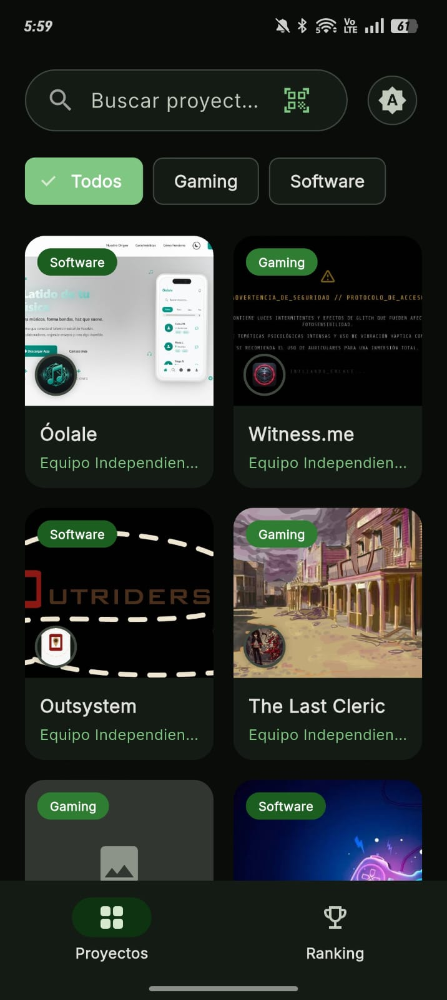
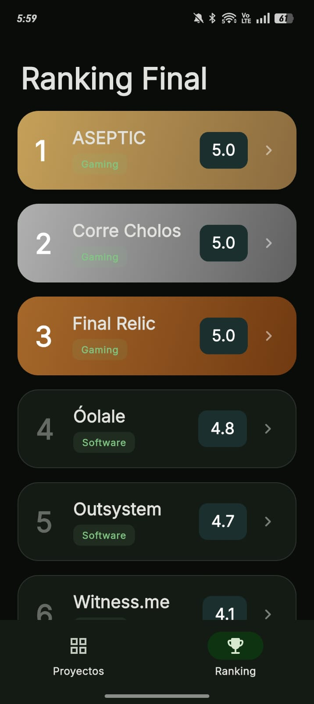
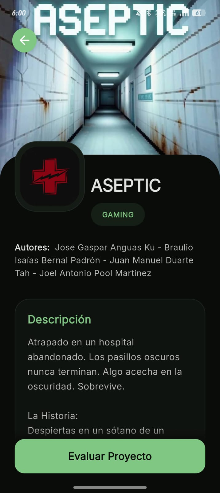
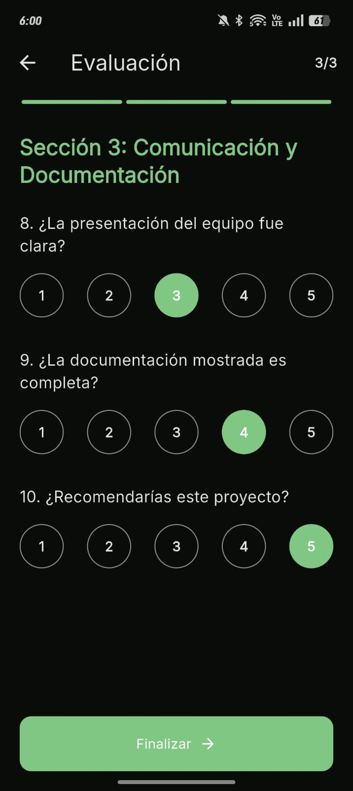

# Kiosco Mobile (Proyex App) 📱


## 📸 Evidencia Visual
<div align="center">
  
  
  
  
</div>

## 📖 Descripción Breve
Proyex Mobile es la interfaz interactiva portátil dirigida a jueces, organizadores y asistentes de la exhibición técnica. Facilita la recolección de feedback cualitativo y cuantitativo al instante, escaneando proyectos físicos en sitio y enviando rúbricas directo al motor backend de PX Forge.

## ✨ Características Principales
- **Escaneo Dinámico de Kioscos:** Módulo de escáner QR integrado para identificar proyectos físicos expuestos en segundos (`mobile_scanner`).
- **Navegación e Interfaz Intuitiva:** Redireccionamiento estilo Web-App muy fluido gracias al sistema asíncrono de `go_router`.
- **Experiencia de Visualización Novedosa:** State management que permite alterar los modos estéticos entre Light/Dark dinámicamente con alta inmersión.
- **Sincronización Transaccional:** Actualizaciones instantáneas bidireccionales consumiendo peticiones robustas desde el Panel backend vía API REST.

## 🏗️ Arquitectura y Stack Tecnológico
- **Frontend Móvil:** Flutter optimizado (SDK Dart > 3.9). Permite compilar a Web y Android Nativo fluidamente.
- **Consumo API:** Integración de peticiones directas y serialización manual/automática basada en el package HTTP.
- **Patrones de Diseño:** Arquitectura granular implementada en base a conceptos de **Clean Architecture**, con segregación de responsabilidades clara (`core`, `data`, `domain`, `presentation`). Modificación de dependencias y reactividad del UI administrada con el patrón de **Inyección de Dependencias vía Provider**.

## ⚙️ Prerrequisitos e Instalación
1. **Flutter SDK** base instalado y configurado en el Path de tu OS.
2. Android Studio o Xcode preparado con emulador en vivo, o habilitación Web (Chrome).
3. Clonar repositorio móvil interactivo:
   ```bash
   git clone https://github.com/IsaiasSinthesys03/Proyex_APP_Mobile.git
   ```
4. Cargar y sincronizar dependencias de Dart vitales:
   ```bash
   flutter pub get
   ```
5. Ejecutar la compilación en sistema activo: 
   ```bash
   flutter run
   ```

## 📂 Estructura de Carpetas
```text
kiosco_mobile/
 ├── android/ & ios/ & web/  # Wrappers de compilación nativa del motor base Flutter
 ├── assets/                 # Recursos multimedia estáticos precargados (Logotipos)
 ├── lib/
 │   ├── core/               # Constantes y configuraciones nucleadas (rutas, temas base)
 │   ├── data/               # Modelos, DTOs y capas de conexión hacia afuera
 │   ├── domain/             # Lógica teórica móvil pura
 │   ├── presentation/       # Vistas (Pages) y micro-widgets reutilizables
 │   └── main.dart           # Punto de entrada e instanciador inyector (Providers)
 └── pubspec.yaml            # Descriptor de requerimientos del package y subdependencias
```

## 👥 El Equipo
Soportar robustez en plataformas cruzadas conlleva una gran tarea. La carga de diseño tecnológico e interfaz en Flutter, acoplada a la férrea vinculación de los eventos cliente-servidor, fue modelada impecablemente por nuestro núcleo de desarrollo estratégico:

- **Braulio Isaias Bernal Padron**
- **Yeng Lee Salas Jimenez**
- **Erick Leonardo Lopez Hernandez**
- **Jonathan Aaron Perez Mendez**

### 🤖 IA-Augmented Development (+IA)
Nuestra App no solo brilla y es veloz con Dart; también encarna el pináculo absoluto del flujo moderno de software. **Este producto fue conceptualizado y programado usando vanguardistas técnicas de IA-Augmented Engineering (+IA).** Teniendo un modelo cuántico asistiéndonos, destrozamos bugs complejos en tiempo récord, pulimos estados lógicos imposibles e implementamos un UI majestuoso que de otra forma tomaría semanas de trasnochos. Usamos Inteligencia Artificial no como un atajo barato, sino como un cohete para **rebasar de largo por completo los límites y expectativas convencionales**. 

---
*(Información original del andamiaje base persistida a continuación)*

# kiosco_mobile

A new Flutter project.

## Getting Started

This project is a starting point for a Flutter application.

A few resources to get you started if this is your first Flutter project:

- [Lab: Write your first Flutter app](https://docs.flutter.dev/get-started/codelab)
- [Cookbook: Useful Flutter samples](https://docs.flutter.dev/cookbook)

For help getting started with Flutter development, view the
[online documentation](https://docs.flutter.dev/), which offers tutorials,
samples, guidance on mobile development, and a full API reference.
